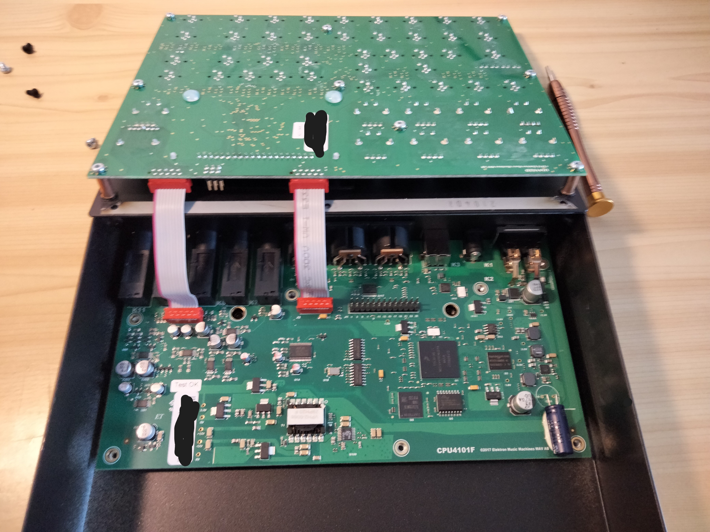
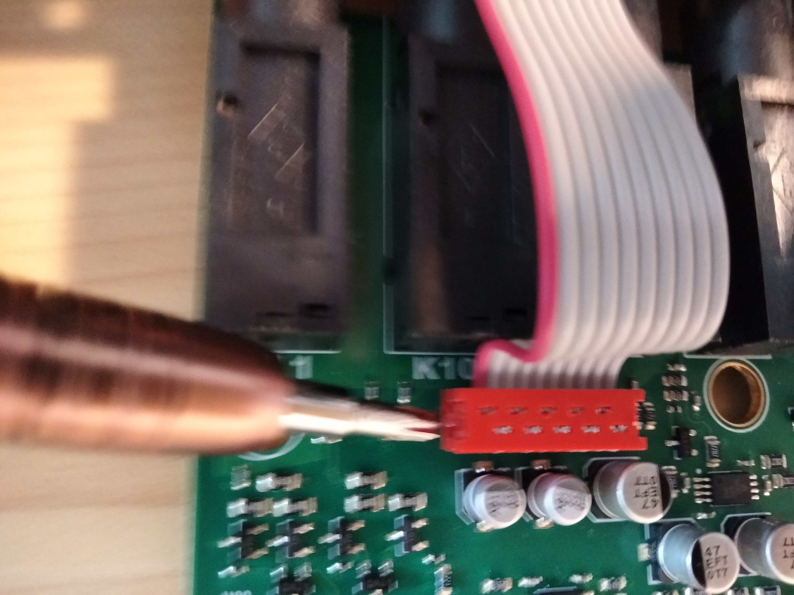
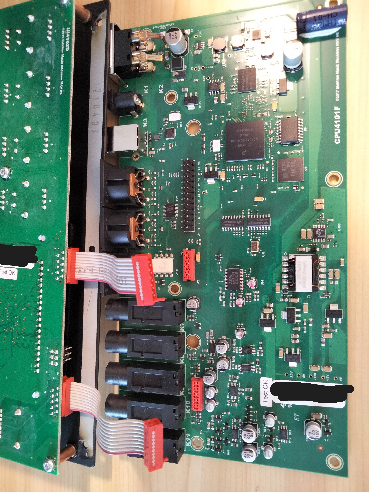
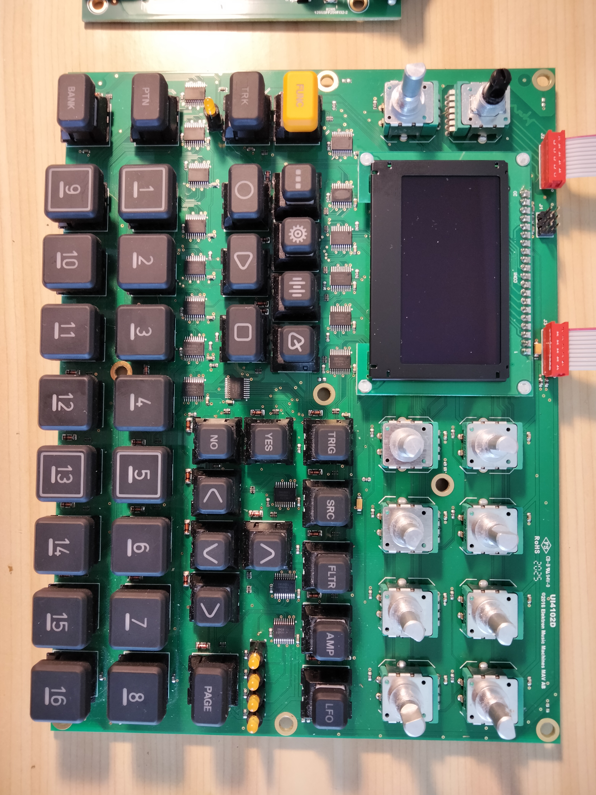
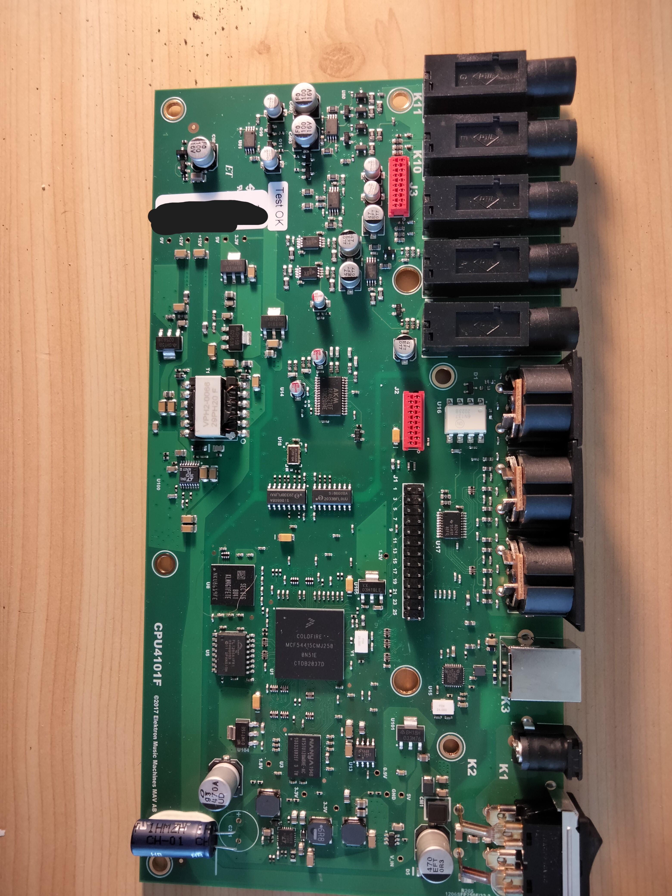
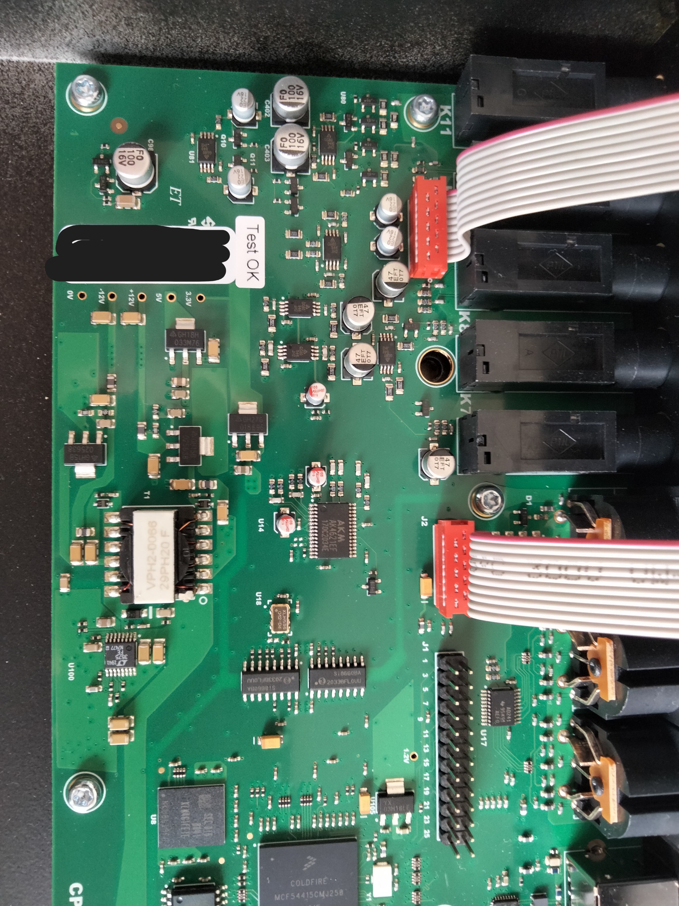
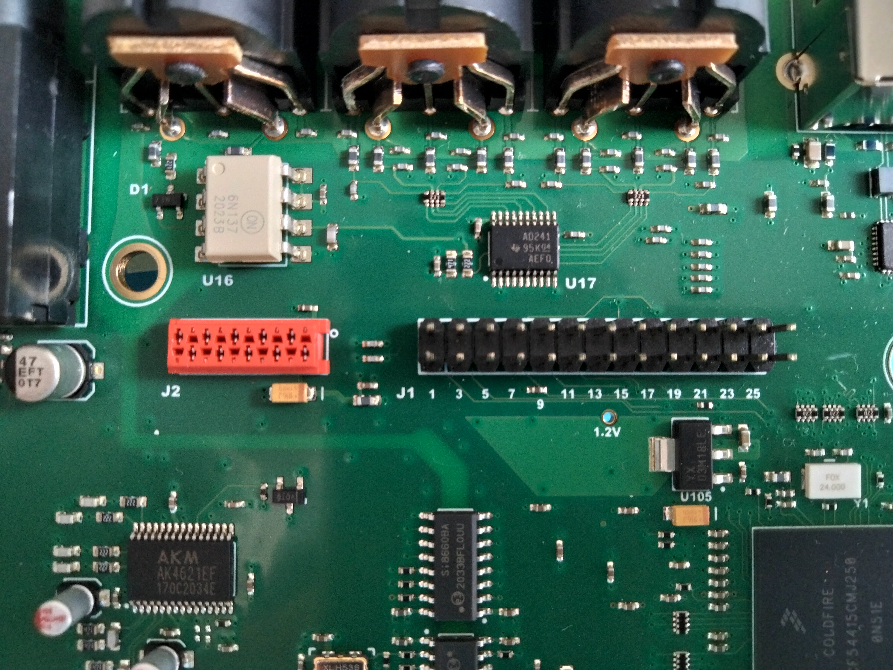

# Introduction

I've owned an Elektron Digitakt for a few years now, and every now and then I have to tear it apart for cleaning or just for fun to show the insides to some friends.
Today is one of those days and I thought I could share the process so that it could benefit to those a little less experienced with such manipulations.
This is fairly easy to do and it should be safe as long as you are equipped with the right tools and are cautious enough.

## Disclaimer

Obviously if you break anything in the process you can only blame yourself. The safest way to handle PCBs is to hold them by their sides. But then again this is really simple to do and quite fun. 

# What to do to tear it down ?
## Tools
Well first you should get a fairly small allen key (I used one I got for bike repairs). To be fair if it fits the front screws you can disassemble the whole device but if you plan on dismantling it often you should get star screw drivers since it's the screws used inside. If your cheap/don't have star screw drivers, you can only just use one allen key just be careful with the head of the screws inside.

## Patience
Well not that much but a tad bit...

# The tearing down process

Just remove the screws that are visible. Start with the outside of the front panel, working your way towards the bottom PCB (see included pic) and then you can dismantle the remaining of the front panel as well if you wish. 

Note that I let the front panel rest on top of the digitakt case (see pics) in order not to stress the flex cables running between the main pcb and the front panel.

You should also note that it is advice (by millions of docotors) to unplug the two big flat flex ribbon cables before doing anything more with the front panel. 

To do so, you may pinch on both sides of the end of the flex cables that are connected to the bottom PCB, aiming for the tip of the small triangle ish thingy (you will get what I mean if you ever do this). Then by firmly holding the connector between two screw drivers you should pull as vertically as possible **both sides at the same time, keeping the connector horizontal**. 
**Also you should remove the encoder's caps before trying to remove the front PCB from the front panel**.

Then Rob's your uncle or whatever.

# Quick analysis / overiew / guessing of what does what

Alright so now that we've opened up our digitakt I can take a look and speculate on what does what inside this little device.

As previously mentioned the digitakt's hardware is split up into two main parts, the front panel which is where the buttons are and encoders are placed, almost no intelligence is done here and only for UI purposes.

The second part is where the magic happens, the main PCB (which is smaller than the other PCB :D)

The main pcb is split into two parts, an analog side and digital side.

The analog part holds no real "brain power". It serves mainly as a way to isolate the CPU (brain power) from the audio inputs and outputs which could introduce unwanted noise. This part is based around the analog circuitry which you can see on the left side and a 2x2 channels ADC/DAC the AK4621EF.
Communications with the CPU is routed through optocouplers which isolate the analog side from the unwanted noise of the digital side and the power input.

The magic is done mainly inside the big chip that you can see in the middle of the board. It's a coldfire MCF54415 from the manufacturer NXP. It runs an instruction set which is inherited from the Motorola 68Ks. This is what is used to playback the sounds and communicate with the User Interface.

I assume Elektron chose to use this chip because it belongs to the family of the chips they used in previous devices (even though I cannot confirm that). They are great for this usage since they provide many DMAs (interface for data transfer) and can interface with a variety of memories. Those chips seem to be also fairly powerful which means they can be used for audio manipulation which can be computationally heavy.
It also houses a DSP which is used for audio processing. 

Around the coldfire microcontroller are three different memories which serves each a different purpose. On the top left side of the microcontroller (in the picture above) is the KLM461FETE which is a 4GB eMMC memory. It's basically just an SDCard that is probably used to store the audio data that is used in the device. It's a persistent memory meaning that it won't be erased when powered down but it is fairly slow compared to the SDRAM.
Now the SDRAM is the NANYA NT5U128M8HE 1GB it is used as a fast memory for the CPU it holds the sounds in the currently loaded project, among other things. This is erased when the power is unplugged meaning that it holds only temporary values as a quickly accessible buffer for the cpu.
Finally the FL128 spansion is a flash memory that is used to store the code executed by the CPU. It is only 128Mbwhich can mean two things either all the code ran by the cpu  is fairly small in it's total size or it is used as a mean to hold code which will be run at boot, used to configure memories (SDRAM eMMC) and then the rest of the code could be loaded from the eMMC which is way bigger.
To be honest I don't really know which is more likely but I wouldn't be surprised that most of the code can be stored inside 128Mb but the the 4Gb eMMC wouldn't make as much sense since you can apparently only store 1Gb of samples in the digitakt which is way smaller than the eMMC size.

Finally as for the midi part two chips are used to interface the microcontroller with the inputs/outputs. First an unknown texas instrument chip labeled AD241 AEF0 (if my eyes aren't betraying me). I think it is used to route signal from the CPU to the MIDI OUT, from the MIDI IN to the CPU and from the MIDI IN to the MIDI thru (cutting some slack for the CPU which doesn't need to handle the midi passthrough). The last small ic is a 6N137 midi optocoupler which is used to isolate the internals from outside midi devices which could induce unwanted noises.

On the picture above you can also see a debug interface, I didn't look more into it since I don't have an oscilloscope at hand but I assume there must be an interface like JTAG for debugging the CPU and some serial interface like UART for readable debug information as well.

# Conclusion

Overall this device is built really well with maintenance in mind. The insides seem to be kept simple and efficient which I like. Not much more to say.
